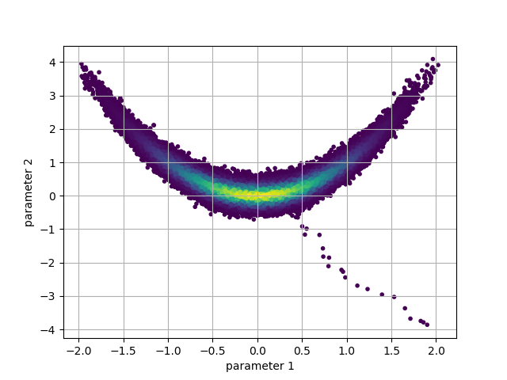
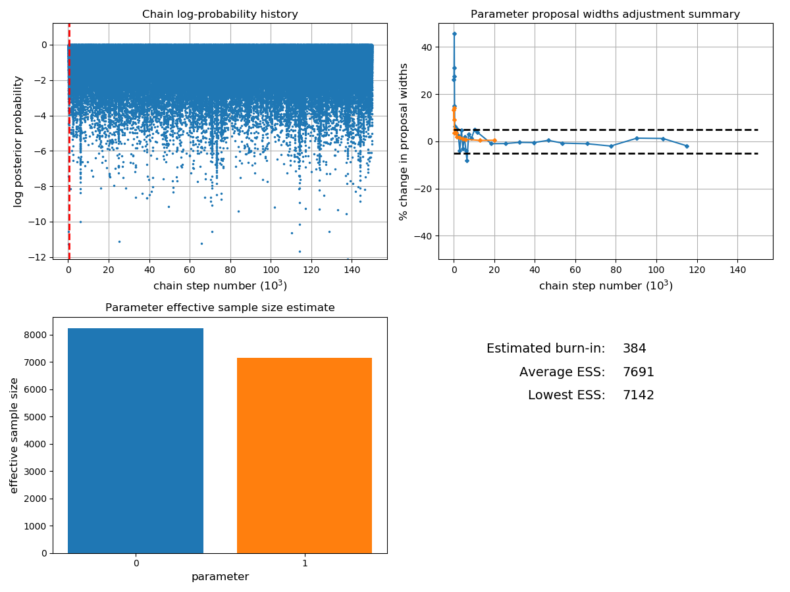
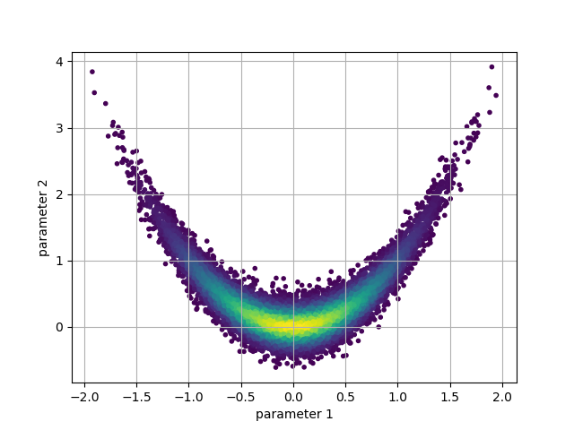
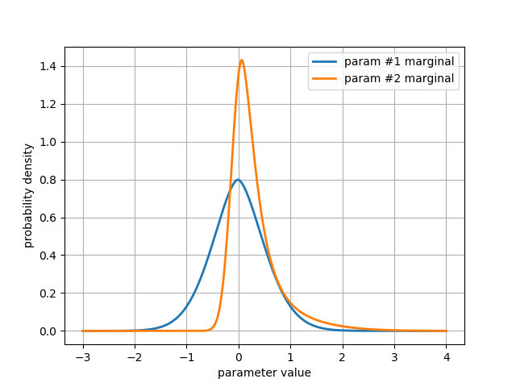

GibbsChain
~~~~~~~~~~

.. autoclass:: inference.mcmc.GibbsChain
   :members: advance, run_for, mode, get_marginal, get_sample, get_parameter, get_interval, plot_diagnostics, matrix_plot, trace_plot, set_non_negative, set_boundaries

GibbsChain example code
^^^^^^^^^^^^^^^^^^^^^^^

Define the Rosenbrock density to use as a test case:

.. code-block:: python

   from numpy import linspace, exp
   import matplotlib.pyplot as plt

   def rosenbrock(t):
       X, Y = t
       X2 = X**2
       return -X2 - 15.*(Y - X2)**2 - 0.5*(X2 + Y**2) / 3.

Create the chain object:

.. code-block:: python

   from inference.mcmc import GibbsChain
   chain = GibbsChain(posterior = rosenbrock, start = [2., -4.])

Advance the chain 150k steps to generate a sample from the posterior:

.. code-block:: python

   chain.advance(150000)

The samples for any parameter can be accessed through the
``get_parameter`` method. We could use this to plot the path of
the chain through the 2D parameter space:

.. code-block:: python

   p = chain.get_probabilities() # color the points by their probability value
   pnt_colors = exp(p - p.max())
   plt.scatter(chain.get_parameter(0), chain.get_parameter(1), c=pnt_colors, marker='.')
   plt.xlabel('parameter 1')
   plt.ylabel('parameter 2')
   plt.grid()
   plt.show()

We can see from this plot that in order to take a representative sample,
some early portion of the chain must be removed. This is referred to as
the 'burn-in' period. This period allows the chain to both find the high
density areas, and adjust the proposal widths to their optimal values.

The ``plot_diagnostics`` method can help us decide what size of burn-in to use:

.. code-block:: python

   chain.plot_diagnostics()

Occasionally samples are also 'thinned' by a factor of n (where only every
n'th sample is used) in order to reduce the size of the data set for
storage, or to produce uncorrelated samples.

Based on the diagnostics we can choose burn and thin values, which can be passed
to methods of the chain that access or operate on the sample data.

.. code-block:: python

   burn = 2000
   thin = 10

By specifying the ``burn`` and ``thin`` values, we can generate a new version of
the earlier plot with the burn-in and thinned samples discarded:

.. code-block:: python

   p = chain.get_probabilities(burn=burn, thin=thin)
   pnt_colors = exp(p - p.max())
   plt.scatter(
       chain.get_parameter(0, burn=burn, thin=thin),
       chain.get_parameter(1, burn=burn, thin=thin),
       c=pnt_colors,
       marker = '.'
   )
   plt.xlabel('parameter 1')
   plt.ylabel('parameter 2')
   plt.grid()
   plt.show()

We can easily estimate 1D marginal distributions for any parameter
using the ``get_marginal`` method:

.. code-block:: python

   pdf_1 = chain.get_marginal(0, burn=burn, thin=thin, unimodal=True)
   pdf_2 = chain.get_marginal(1, burn=burn, thin=thin, unimodal=True)

``get_marginal`` returns a density estimator object, which can be called
as a function to return the value of the pdf at any point:

.. code-block:: python

   axis = linspace(-3, 4, 500) # axis on which to evaluate the marginal PDFs
   # plot the marginal distributions
   plt.plot(axis, pdf_1(axis), label='param #1 marginal', lw=2)
   plt.plot(axis, pdf_2(axis), label='param #2 marginal', lw=2)
   plt.xlabel('parameter value')
   plt.ylabel('probability density')
   plt.legend()
   plt.grid()
   plt.show()

