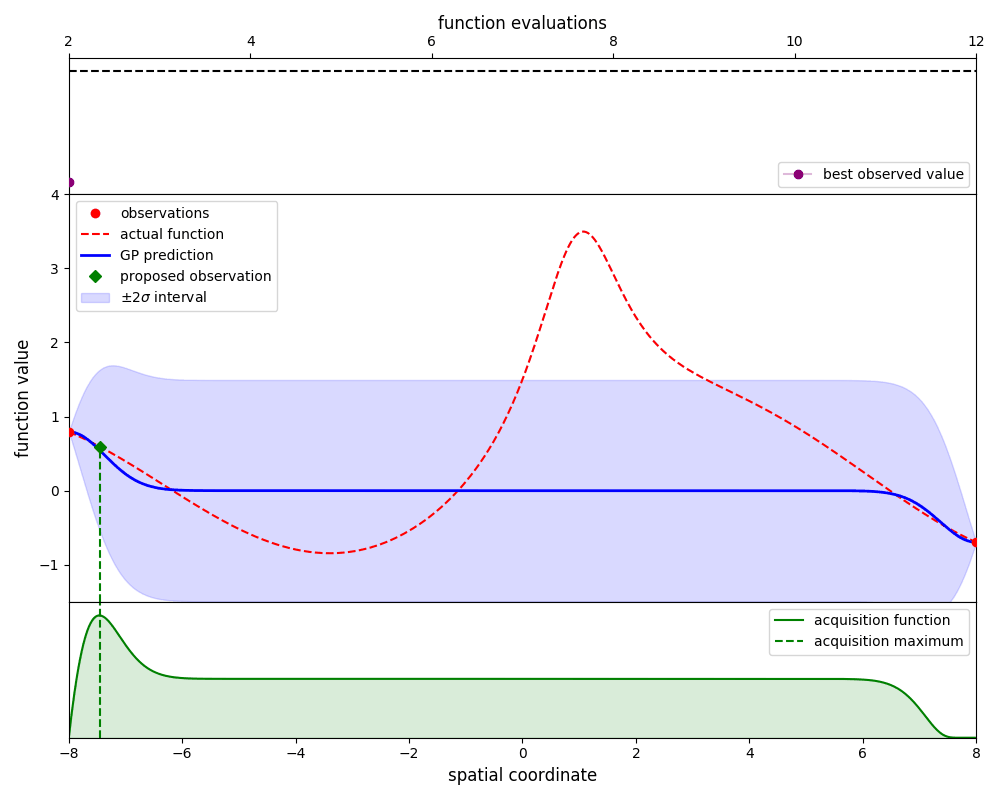

GpOptimiser
~~~~~~~~~~~

.. autoclass:: inference.gp.GpOptimiser
   :members: propose_evaluation, add_evaluation

Example code
^^^^^^^^^^^^

Gaussian-process optimisation efficiently searches for the global maximum of a function
by iteratively 'learning' the structure of that function as new evaluations are made.

As an example, define a simple 1D function:

.. code-block:: python

   from numpy import sin

   def search_function(x): # Lorentzian plus a sine wave
      return sin(0.5 * x) + 3 / (1 + (x - 1)**2)

Define some bounds for the optimisation, and make some evaluations of the function
that will be used to build the initial gaussian-process estimate:

.. code-block:: python

   # define bounds for the optimisation
   bounds = [(-8.0, 8.0)]

   # create some initialisation data
   x = array([-8.0, 8.0])
   y = search_function(x)

Create an instance of GpOptimiser:

.. code-block:: python

   from inference.gp import GpOptimiser
   GP = GpOptimiser(x, y, bounds=bounds)

By using the ``propose_evaluation`` method, GpOptimiser will propose a new evaluation of
the function. This proposed evaluation is generated by maximising an `acquisition function`,
in this case the 'expected improvement' function. The new evaluation can be used to update
the estimate by using the ``add_evaluation`` method, which leads to the following loop:

.. code-block:: python

   for i in range(11):
      # request the proposed evaluation
      new_x = GP.propose_evaluation()

      # evaluate the new point
      new_y = search_function(new_x)

      # update the gaussian process with the new information
      GP.add_evaluation(new_x, new_y)

Here we plot the state of the estimate at each iteration:

