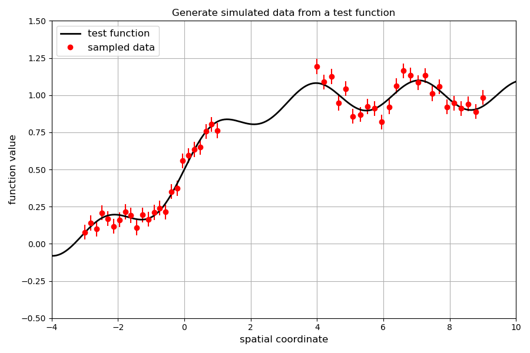
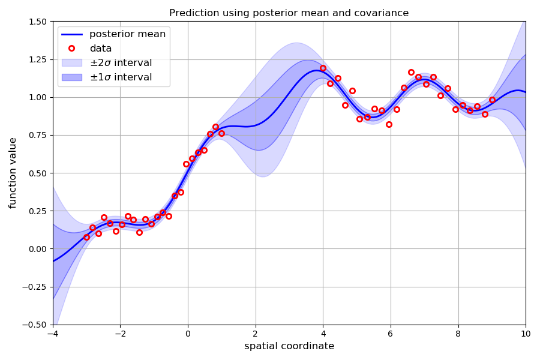
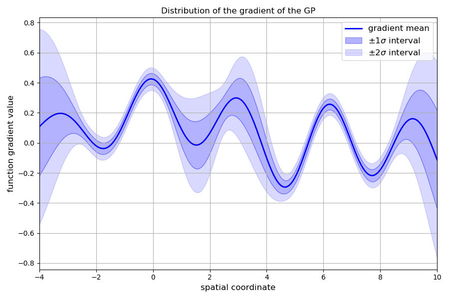

GpRegressor
~~~~~~~~~~~

.. autoclass:: inference.gp_tools.GpRegressor
   :members: __call__, gradient, build_posterior

Example code
^^^^^^^^^^^^

Create some testing data

.. code-block:: python

   from numpy import linspace, concatenate, exp, sin, zeros
   from numpy.random import normal

   Nx = 24*2 # create an x-axis with a gap in it
   x = concatenate([linspace(-3,1,Nx//2),linspace(4,9,Nx//2)])
   sig = 0.05 # assumed normal error on the data points
   y   = ( 1. / (1 + exp(-x)) ) + 0.1*sin(2*x) + sig*normal(size=Nx) # sampled y data
   errs = zeros(Nx) + sig # y data errors

Generate points a set of points ``q`` at which to evaluate the GP regression estimate

.. code-block:: python

   Nq = 200
   q = linspace(-4, 10, Nq) # cover whole range, including the gap

Plot the data points plus the underlying function from which they are sampled

.. code-block:: python

   import matplotlib.pyplot as plt

   fig = plt.figure( figsize = (12,6) )
   ax = fig.add_subplot(111)
   ax.plot(q, 1./(1. + exp(-q)) + 0.1*sin(2*q), lw = 2, color = 'black', label = 'test function')
   ax.plot(x, y, 'o', color = 'red', label = 'sampled data')
   ax.errorbar(x, y, yerr = errs, fmt = 'none', ecolor = 'red')
   ax.set_ylim([-0.5, 1.5])
   ax.set_xlim([-4, 10])
   ax.set_title('Generate simulated data from a test function')
   ax.set_ylabel('function value')
   ax.set_xlabel('spatial coordinate')
   ax.grid()
   ax.legend(loc=2)
   plt.tight_layout()
   plt.show()

Initialise the class with the data and errors

.. code-block:: python

   GP = GpRegressor(x, y, y_err = errs)

Call the instance to the mean and standard deviation of the regression estimate for the points in q

.. code-block:: python

   mu_q, sig_q = GP(q)

Now plot the regression estimate and the data together

.. code-block:: python

   fig = plt.figure( figsize = (12,6) )
   ax = fig.add_subplot(111)
   ax.plot(q, mu_q, lw = 2, color = 'blue', label = 'posterior mean')
   ax.fill_between(q, mu_q-sig_q, mu_q-sig_q*2, color = 'blue', alpha = 0.15, label = r'$\pm 2 \sigma$ interval')
   ax.fill_between(q, mu_q+sig_q, mu_q+sig_q*2, color = 'blue', alpha = 0.15)
   ax.fill_between(q, mu_q-sig_q, mu_q+sig_q, color = 'blue', alpha = 0.3, label = r'$\pm 1 \sigma$ interval')
   ax.plot(x, y, 'o', color = 'red', label = 'data', markerfacecolor = 'none', markeredgewidth = 2)
   ax.set_ylim([-0.5, 1.5])
   ax.set_xlim([-4, 10])
   ax.set_title('Prediction using posterior mean and covariance')
   ax.set_ylabel('function value')
   ax.set_xlabel('spatial coordinate')
   ax.grid()
   ax.legend(loc=2, fontsize = 12)
   plt.tight_layout()
   plt.show()

As the estimate itself is defined by a multivariate normal distribution, we can draw samples
from that distribution. To do this, we need to build the full covariance matrix and mean for the
desired set of points using the ``build_posterior`` method:

.. code-block:: python

   # get the posterior information
   mu, covariance = GP.build_posterior(q)
   # now draw samples
   from numpy.random import multivariate_normal
   samples = multivariate_normal(mu, covariance, 100)
   # and plot all the samples
   fig = plt.figure( figsize = (12,6) )
   ax = fig.add_subplot(111)
   for i in range(100):
       ax.plot(q, samples[i,:], lw = 0.5)
   ax.set_title('100 samples drawn from the posterior distribution')
   ax.set_xlim([-4, 10])
   plt.grid()
   plt.tight_layout()
   plt.show()

The gradient of the Gaussian process estimate also has a multivariate normal distribution.
The mean vector and covariance matrix of the gradient distribution for a series of points
can be generated using the ``gradient`` method:

.. code-block:: python

   gradient_mean, gradient_variance = GP.gradient(q)
   # in this example we have only one spatial dimension, so the covariance matrix has size 1x1
   sigma = sqrt(gradient_variance) # get the standard deviation at each point in 'q'

   # plot the distribution of the gradient
   fig = plt.figure( figsize = (12,6) )
   ax = fig.add_subplot(111)
   ax.plot(q, gradient_mean, lw = 2, color = 'blue', label = 'gradient mean')
   ax.fill_between(q, gradient_mean-sigma, gradient_mean+sigma, alpha = 0.3, color = 'blue', label = r'$\pm 1 \sigma$ interval')
   ax.fill_between(q, gradient_mean+sigma, gradient_mean+2*sigma, alpha = 0.15, color = 'blue', label = r'$\pm 2 \sigma$ interval')
   ax.fill_between(q, gradient_mean-sigma, gradient_mean-2*sigma, alpha = 0.15, color = 'blue')
   ax.set_title('Distribution of the gradient of the GP')
   ax.set_ylabel('function gradient value')
   ax.set_xlabel('spatial coordinate')
   ax.set_xlim([-4, 10])
   ax.grid()
   ax.legend(fontsize = 12)
   plt.tight_layout()
   plt.show()

