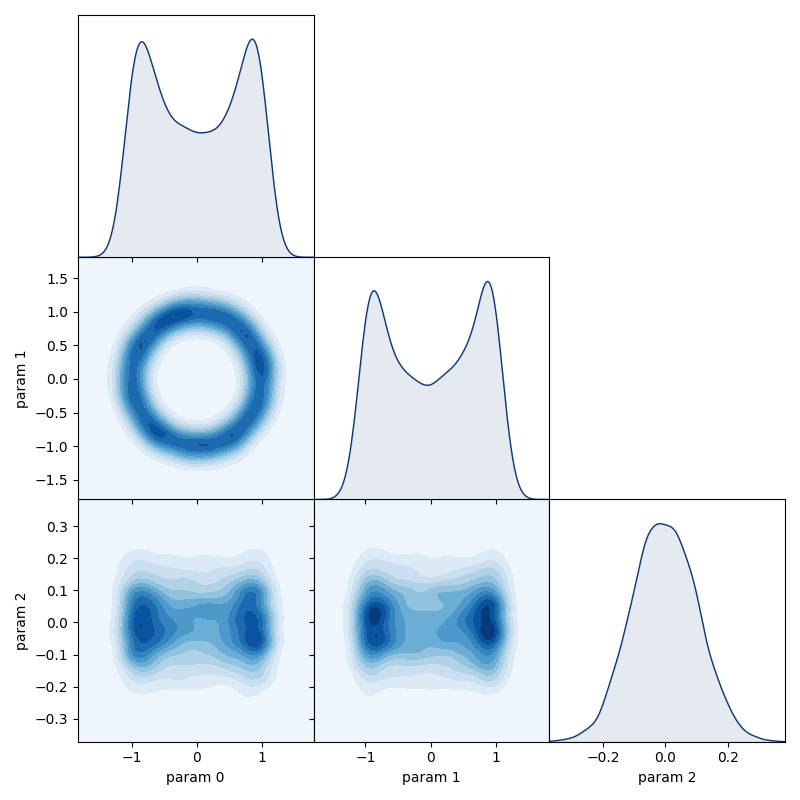

HamiltonianChain
~~~~~~~~~~~~~~~~

.. autoclass:: inference.mcmc.HamiltonianChain
   :members: advance, run_for, mode, get_marginal, get_parameter, plot_diagnostics, matrix_plot, trace_plot

HamiltonianChain example code
^^^^^^^^^^^^^^^^^^^^^^^^^^^^^

Here we define a toroidal (donut-shaped!) posterior distribution which has strong non-linear correlation:

.. code-block:: python

   from numpy import array, sqrt

   class ToroidalGaussian:
      def __init__(self):
         self.R0 = 1.  # torus major radius
         self.ar = 10. # torus aspect ratio
         self.inv_w2 = (self.ar / self.R0)**2

      def __call__(self, theta):
         x, y, z = theta
         r_sqr = z**2 + (sqrt(x**2 + y**2) - self.R0)**2
         return -0.5 * self.inv_w2 * r_sqr

      def gradient(self, theta):
         x, y, z = theta
         R = sqrt(x**2 + y**2)
         K = 1 - self.R0 / R
         g = array([K*x, K*y, z])
         return -g * self.inv_w2

Build the posterior and chain objects then generate the sample:

.. code-block:: python

   # create an instance of our posterior class
   posterior = ToroidalGaussian()

   # create the chain object
   chain = HamiltonianChain(
       posterior = posterior,
       grad=posterior.gradient,
       start = [1, 0.1, 0.1]
   )

   # advance the chain to generate the sample
   chain.advance(6000)

   # choose how many samples will be thrown away from the start of the chain as 'burn-in'
   burn = 2000

We can use the `Plotly <https://plot.ly/>`_ library to generate an interactive 3D scatterplot of our sample:

.. code-block:: python

   # extract sample and probability data from the chain
   probs = chain.get_probabilities(burn=burn)
   point_colors = exp(probs - probs.max())
   x, y, z = [chain.get_parameter(i) for i in [0, 1, 2]]

   # build the scatterplot using plotly
   import plotly.graph_objects as go

   fig = go.Figure(data=1[go.Scatter3d(
      x=x, y=y, z=z, mode='markers',
      marker=dict(size=5, color=point_colors, colorscale='Viridis', opacity=0.6)
   )])

   fig.update_layout(margin=dict(l=0, r=0, b=0, t=0)) # set a tight layout
   fig.show()

.. raw:: html
   :file: ./images/HamiltonianChain_images/hmc_scatterplot.html

We can view all the corresponding 1D & 2D marginal distributions using the ``matrix_plot`` method of the chain:

.. code-block:: python

   chain.matrix_plot(burn=burn)

