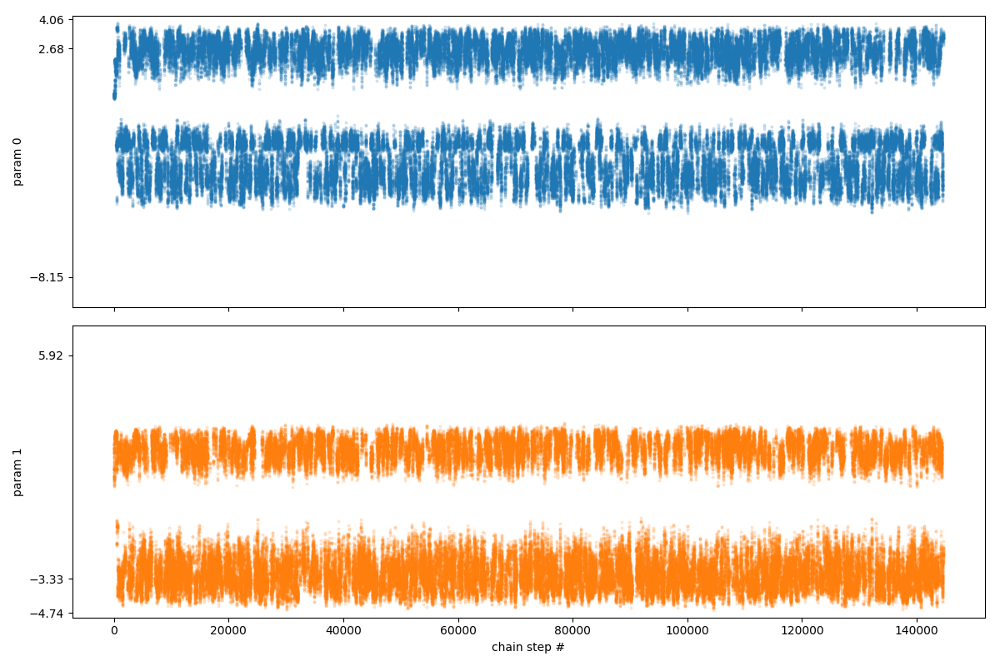
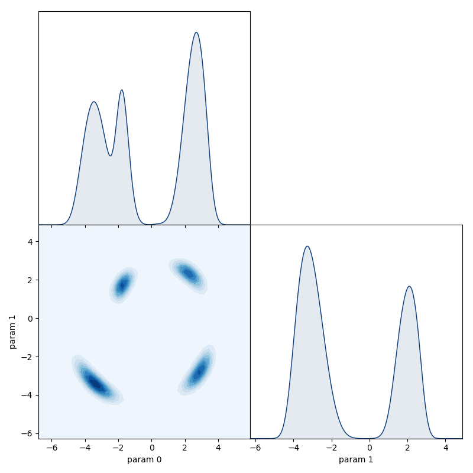

ParallelTempering
~~~~~~~~~~~~~~~~~

.. autoclass:: inference.mcmc.ParallelTempering
   :members: advance, run_for, shutdown, return_chains

ParallelTempering example code
^^^^^^^^^^^^^^^^^^^^^^^^^^^^^^

Define a posterior with separated maxima, which is difficult
for a single chain to explore:

.. code-block:: python

   from numpy import log, sqrt, sin, arctan2, pi

   # define a posterior with multiple separate peaks
   def multimodal_posterior(theta):
      x, y = theta
      r = sqrt(x**2 + y**2)
      phi = arctan2(y, x)
      z = (r - (0.5 + pi - phi*0.5)) / 0.1
      return -0.5*z**2  + 4*log(sin(phi*2.)**2)

Define a set of temperature levels:

.. code-block:: python

   N_levels = 6
   temperatures = [10**(2.5*k/(N_levels-1.)) for k in range(N_levels)]

Create a set of chains - one with each temperature:

.. code-block:: python

   from inference.mcmc import GibbsChain, ParallelTempering
   chains = [
       GibbsChain(posterior=multimodal_posterior, start=[0.5, 0.5], temperature=T)
       for T in temperatures
   ]

When an instance of ``ParallelTempering`` is created, a dedicated process for each
chain is spawned. These separate processes will automatically make use of the available
cpu cores, such that the computations to advance the separate chains are performed in parallel.

.. code-block:: python

   PT = ParallelTempering(chains=chains)

These processes wait for instructions which can be sent using the methods of the
``ParallelTempering`` object:

.. code-block:: python

   PT.run_for(minutes=0.5)

To recover a copy of the chains held by the processes we can use the
``return_chains`` method:

.. code-block:: python

   chains = PT.return_chains()

By looking at the trace plot for the T = 1 chain, we see that it makes
large jumps across the parameter space due to the swaps:

.. code-block:: python

   chains[0].trace_plot()

Even though the posterior has strongly separated peaks, the T = 1 chain
was able to explore all of them due to the swaps.

.. code-block:: python

   chains[0].matrix_plot()

Because each process waits for instructions from the ``ParallelTempering`` object,
they will not self-terminate. To terminate all the processes we have to trigger
a shutdown even using the ``shutdown`` method:

.. code-block:: python

   PT.shutdown()
