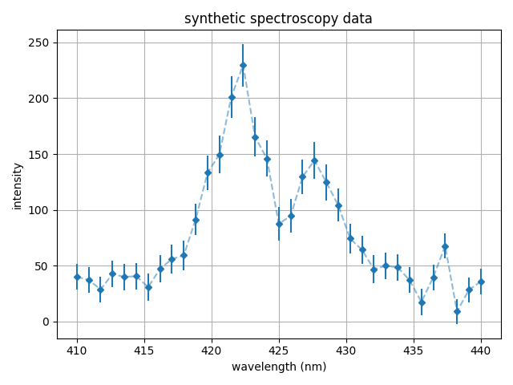
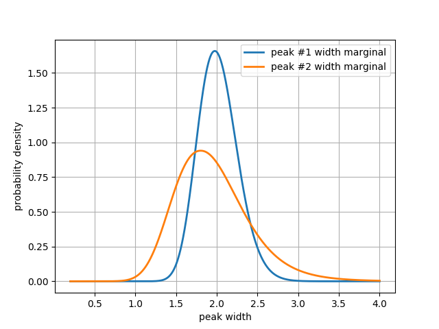

Getting started
===============

.. _Installation:

Installation
------------

inference-tools is available from `PyPI <https://pypi.org/project/inference-tools/>`_, so can
be easily installed using `pip <https://pip.pypa.io/en/stable/>`_: as follows:

.. code-block:: bash

   pip install inference-tools

If pip is not available, you can clone from the GitHub `source repository <https://github.com/C-bowman/inference-tools>`_
or download the files from `PyPI <https://pypi.org/project/inference-tools/>`_ directly.

Jupyter notebook demos
----------------------

In addition to the example code present in the online documentation for each class/function in the
package, there is also a set of Jupyter notebook demos which can be found in the
`/demos/ <https://github.com/C-bowman/inference-tools/tree/PyPI-release/demos>`_ directory of the source
code.

Example - spectroscopy data fitting
-----------------------------------

Here we work through a toy problem of fitting the following synthetic spectroscopy data, which contains two
peaks with known centres and a constant background:

First let's define a class to evaluate the log-posterior:

.. code-block:: python

   class SpectroscopyPosterior(object):
      def __init__(self, wavelength, intensity, errors):
         # store the data
         self.x = wavelength
         self.y = intensity
         self.sigma = errors
         # Central wavelengths of the lines are known constants:
         self.c1 = 422.
         self.c2 = 428.

      def __call__(self, theta): # __call__ returns our posterior log-probability
         return self.likelihood(theta) # omitting prior term here means our prior is uniform

      def likelihood(self, theta): # Gaussian likelihood
         return -0.5*( ((self.y - self.forward_model(self.x, theta)) / self.sigma)**2 ).sum()

      def forward_model(self, x, theta):
         # unpack the model parameters
         A1, w1, A2, w2, bg = theta
         # evaluate the peaks
         peak_1 = A1 / ((pi*w1)*(1. + ((x - self.c1)/w1)**2))
         peak_2 = A2 / ((pi*w2)*(1. + ((x - self.c2)/w2)**2))
         # return the prediction of the data
         return peak_1 + peak_2 + bg

Create an instance of the posterior class, and import one of the Markov-chain Monte-Carlo samplers from
``inference.mcmc``:

.. code-block:: python

   from inference.mcmc import PcaChain
   posterior = SpectroscopyPosterior(wavelength, intensity, errors)

As a minimum the MCMC sampling classes in ``inference.mcmc`` must be provided with a
log-posterior function and a starting location for the chain:

.. code-block:: python

   chain = PcaChain(posterior = posterior, start = [1000, 1, 1000, 1, 20])

The chain can be advanced for a given number of steps using the ``advance`` method:

.. code-block:: python

   chain.advance(50000)

We can view diagnostics which give useful information regarding the convergence of the
sample using the ``plot_diagnostics`` method:

.. code-block:: python

   chain.plot_diagnostics()

.. image:: ./images/getting_started_images/plot_diagnostics_example.png

The diagnostics plot shows the history of the chains log-probability, the convergence of tuning parameters
such as proposal distribution widths, and effective sample size estimates for each parameter.

As this problem has five free parameters, the resulting posterior distribution is five-dimensional,
so we cannot visualise it directly. Instead, we can produce a 'matrix plot' of the posterior, which
shows all possible 1D and 2D marginal distributions, using the ``matrix_plot`` method:

.. code-block:: python

   labels = ['peak 1 area', 'peak 1 width', 'peak 2 area', 'peak 2 width', 'background']
   chain.matrix_plot( labels = labels )

.. image:: ./images/getting_started_images/matrix_plot_example.png

We can easily estimate 1D marginal distributions for any parameter using the ``get_marginal`` method:

.. code-block:: python

   w1_pdf = chain.get_marginal(1, unimodal = True)
   w2_pdf = chain.get_marginal(3, unimodal = True)

``get_marginal`` returns an instance of one of the `density estimator` classes from the ``pdf_tools`` module.
These objects can be called as functions to return an estimate of the pdf that best represents the sample data.

.. code-block:: python

   ax = linspace(0.2, 4., 1000) # build an axis to evaluate the pdf estimates
   plt.plot(ax, w1_pdf(ax), label = 'peak #1 width marginal', lw = 2) # plot the marginals
   plt.plot(ax, w2_pdf(ax), label = 'peak #2 width marginal', lw = 2)
   plt.xlabel('peak width')
   plt.ylabel('probability density')
   plt.legend()
   plt.grid()
   plt.show()

Sample data for specific parameters can be accessed using the ``get parameter`` method:

.. code-block:: python

   w1_sample = chain.get_parameter(1)
   w2_sample = chain.get_parameter(3)

To estimate the PDF of a quantity derived from the sample data, for example the ratio of the two peak widths,
we can use one of the ``pdf_tools`` density estimators directly:

.. code-block:: python

   from inference.pdf_tools import UnimodalPdf
   width_ratio_sample = [a/b for a,b in zip(w1_sample,w2_sample)]
   width_ratio_pdf = UnimodalPdf(widths_ratio)

We can generate a plot which summaries the properties of the estimated PDF using the ``plot_summary`` method:

.. code-block:: python

   width_ratio_pdf.plot_summary(label = 'Peak widths ratio')

.. image:: ./images/getting_started_images/pdf_summary_example.png

You may also want to assess the level of uncertainty in the model predictions. This can be done easily by passing
each sample through the forward-model and observing the distribution of model expressions that result.

We can use ``inference.plotting.hdi_plot`` to plot highest-density intervals for the sample of model predictions:

.. code-block:: python

   # generate an axis on which to evaluate the model
   M = 500
   x_fits = linspace(400, 450, M)
   # get the sample
   sample = chain.get_sample()
   # pass each through the forward model
   curves = array([posterior.forward_model(x_fits, theta) for theta in sample])

   plt.figure(figsize = (8,5))

   # We can use the hdi_plot function from the plotting module to plot
   # highest-density intervals for each point where the model is evaluated:
   from inference.plotting import hdi_plot
   hdi_plot(x_fits, curves)

   # build the rest of the plot
   plt.plot( x_data, y_data, 'D', c = 'red', label = 'data', markeredgecolor = 'black')
   plt.xlabel('wavelength (nm)')
   plt.ylabel('intensity')
   plt.xlim([410, 440])
   plt.legend()
   plt.grid()
   plt.tight_layout()
   plt.show()

.. image:: ./images/getting_started_images/prediction_uncertainty_example.png