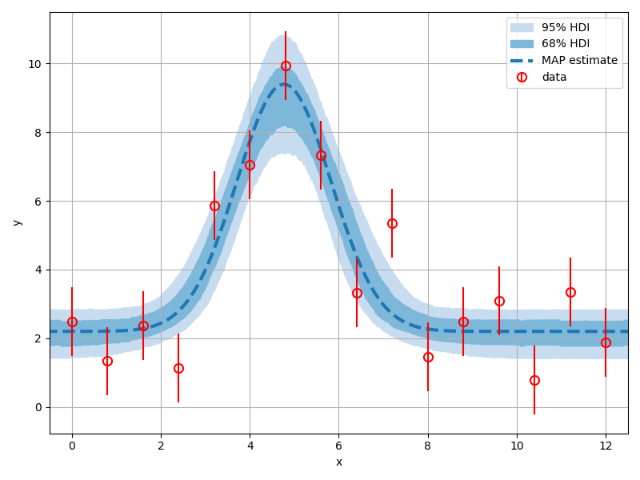

Getting started
===============

.. _Installation:

Installation
------------

inference-tools is available from `PyPI <https://pypi.org/project/inference-tools/>`_,
so can be easily installed using `pip <https://pip.pypa.io/en/stable/>`_: as follows:

.. code-block:: bash

   pip install inference-tools

If pip is not available, you can clone from the GitHub `source repository <https://github.com/C-bowman/inference-tools>`_
or download the files from `PyPI <https://pypi.org/project/inference-tools/>`_ directly.

Jupyter notebook demos
----------------------

In addition to the example code present in the online documentation for each class/function
in the package, there is also a set of Jupyter notebook demos which can be found in the
`/demos/ <https://github.com/C-bowman/inference-tools/tree/master/demos>`_ directory
of the source code.

Example - Gaussian peak fitting
-------------------------------

Suppose we have the following dataset:

.. code-block:: python

   x_data = [0.00, 0.80, 1.60, 2.40, 3.20, 4.00, 4.80, 5.60,
             6.40, 7.20, 8.00, 8.80, 9.60, 10.4, 11.2, 12.0]

   y_data = [2.473, 1.329, 2.370, 1.135, 5.861, 7.045, 9.942, 7.335,
             3.329, 5.348, 1.462, 2.476, 3.096, 0.784, 3.342, 1.877]

   y_error = [1., 1., 1., 1., 1., 1., 1., 1.,
              1., 1., 1., 1., 1., 1., 1., 1.]

Our model :math:`F(x)` for this data is a Gaussian plus a constant background such that

.. math::

   F(x) = \frac{A}{w\sqrt{2\pi}}\exp{\left(-\frac{1}{2}\frac{(x-c)^2}{w^2}\right)} + b

where our model parameters are the area under the gaussian :math:`A`, the width :math:`w`,
center :math:`c` and background :math:`b`.

In this example we're going to:

- Construct a likelihood distribution using the model and our dataset.
- Construct a prior distribution for the model parameters.
- Combine the likelihood and prior to create a posterior distribution.
- Sample from the posterior using MCMC.
- Use the sample to make inferences about the model parameters.

Constructing the likelihood
^^^^^^^^^^^^^^^^^^^^^^^^^^^
The first step is to implement our model. For simple models like this one this can be
done using just a function, but as models become more complex it is becomes useful to
build them as classes. Here we implement the model as the ``PeakModel`` class, where by
defining the ``__call__`` instance method, an instance of ``PeakModel`` can be called as a
function to return a prediction of the y-data values.

.. code-block:: python

   class PeakModel:
       def __init__(self, x_data):
           """
           The __init__ should be used to pass in any data which is required
           by the model to produce predictions of the y-data values.
           """
           self.x = x_data

       def __call__(self, theta):
           return self.forward_model(self.x, theta)

       @staticmethod
       def forward_model(x, theta):
           """
           The forward model must make a prediction of the experimental data we would
           expect to measure given a specific set model parameters 'theta'.
           """
           # unpack the model parameters
           area, width, center, background = theta
           # calculate and return the prediction of the y-data values
           z = (x - center) / width
           gaussian = exp(-0.5 * z**2) / (sqrt(2 * pi) * width)
           return area * gaussian + background

Inference-tools has a variety of likelihood classes which allow you to easily construct
a likelihood function given the measured data and your forward-model.

As in this example we assume the errors on the y-data values to be Gaussian, we use the
``GaussianLikelihood`` class from the ``likelihoods`` module:

.. code-block:: python

   from inference.likelihoods import GaussianLikelihood
   likelihood = GaussianLikelihood(
       y_data=y_data,
       sigma=y_error,
       forward_model=PeakModel(x_data)
   )

Instances of the likelihood classes can be called as functions, and return the
log-likelihood when passed a vector of model parameters.

Constructing the prior
^^^^^^^^^^^^^^^^^^^^^^

In the common case that the prior distribution for each model variable is independent of
the others (i.e. the prior over all variables can be written as a product of priors over
each individual variable) the ``inference.priors`` module has tools which allow us to
build a prior easily.

Which model parameters are assigned to a given prior is specified using the indices of
those parameters (i.e. the position they hold in the parameter vector as defined in the
``PeakModel`` class we wrote earlier).

Suppose we want the area, width and background parameters of the model to each have an
exponential prior. The indices of the area, width and background parameters are
``[0, 1, 3]`` respectively, and we pass these indices to the ``ExponentialPrior`` class
via the ``variable_indices`` argument:

.. code-block:: python

   from inference.priors import ExponentialPrior
   exp_prior = ExponentialPrior(beta=[50., 20., 20.], variable_indices=[0, 1, 3])

We can assign the 'center' parameter a uniform distribution in the same way using
the ``UniformPrior`` class:

.. code-block:: python

   from inference.priors import UniformPrior
   uni_prior = UniformPrior(lower=0., upper=12., variable_indices=[2])

Now we use the ``JointPrior`` class to combine the various components into a single prior
distribution which covers all the model parameters:

.. code-block:: python

   from inference.priors import JointPrior
   prior_components = [exp_prior, uni_prior]
   prior = JointPrior(components=prior_components, n_variables=4)

Sampling from the posterior
^^^^^^^^^^^^^^^^^^^^^^^^^^^

The likelihood and prior can be easily combined into a posterior distribution
using the ``Posterior`` class:

.. code-block:: python

   from inference.posterior import Posterior
   posterior = Posterior(likelihood=likelihood, prior=prior)

Now we have constructed a posterior distribution, we can sample from it
using Markov-chain Monte-Carlo (MCMC).

The ``inference.mcmc`` module contains implementations of various MCMC sampling algorithms.
Here we import the ``PcaChain`` class and use it to create a Markov-chain object:

.. code-block:: python

   from inference.mcmc import PcaChain
   chain = PcaChain(posterior=posterior, start=initial_guess)

We generate samples by advancing the chain by a chosen number of steps using
the `advance` method:

.. code-block:: python

   chain.advance(25000)

We can check the status of the chain using the ``plot_diagnostics`` method:

.. code-block:: python

   chain.plot_diagnostics()

.. image:: ./images/getting_started_images/plot_diagnostics_example.png

The burn-in (how many samples from the start of the chain are discarded)
can be passed as an argument to methods which access or plot sampling results:

.. code-block:: python

   burn = 5000

Using the sample to infer the model parameters
^^^^^^^^^^^^^^^^^^^^^^^^^^^^^^^^^^^^^^^^^^^^^^

We can get a overview of the posterior using the ``matrix_plot`` method
of chain objects, which plots all possible 1D & 2D marginal distributions
of the full parameter set (or a chosen sub-set).

.. code-block:: python

   labels = ['area', 'width', 'center', 'background']
   chain.matrix_plot(labels=labels, burn=burn)

.. image:: ./images/getting_started_images/matrix_plot_example.png

We can easily estimate 1D marginal distributions for any parameter
using the ``get_marginal`` method:

.. code-block:: python

   area_pdf = chain.get_marginal(0, burn=burn)
   area_pdf.plot_summary(label='Gaussian area')

We can assess the level of uncertainty in the model predictions by passing each sample
through the forward-model and observing the distribution of model expressions that result:

.. code-block:: python

   # generate an axis on which to evaluate the model
   x_fits = linspace(-1, 13, 500)
   # get the sample
   sample = chain.get_sample(burn=burn)
   # pass each through the forward model
   curves = array([PeakModel.forward_model(x_fits, theta) for theta in sample])

We could plot the predictions for each sample all on a single graph, but this is
often cluttered and difficult to interpret.

A better option is to use the ``hdi_plot`` function from the ``plotting`` module to plot
highest-density intervals for each point where the model is evaluated:

