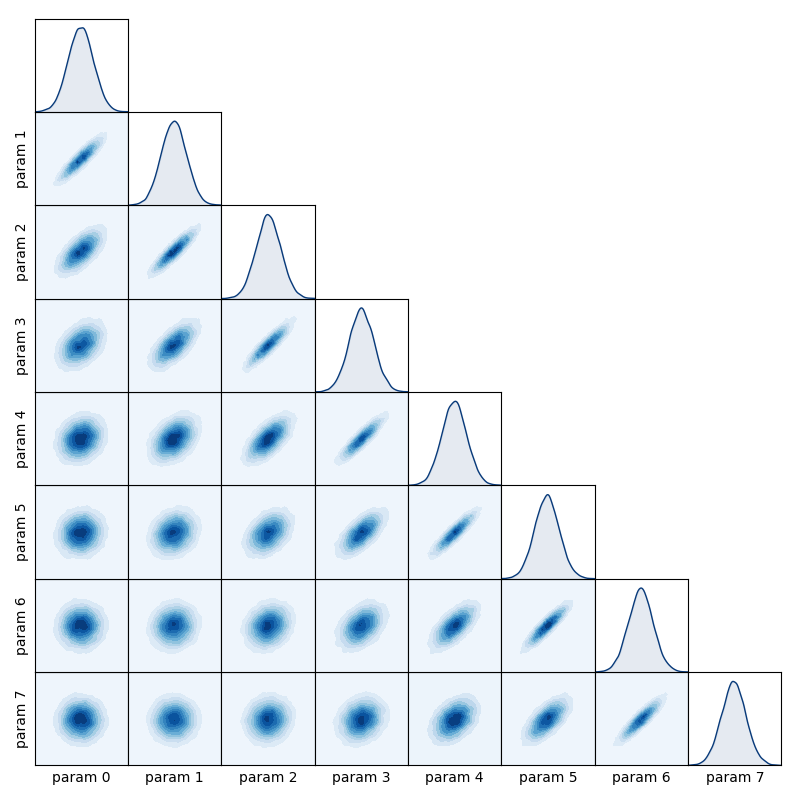

Plotting and visualisation of inference results
===============================================

This module provides functions to generate common types of plots used to visualise
inference results.

matrix_plot
-----------

.. autofunction:: inference.plotting.matrix_plot

Create a spatial axis and use it to define a Gaussian process

.. code-block:: python

   from numpy import linspace, zeros, subtract, exp

   N = 8
   x = linspace(1, N, N)
   mean = zeros(N)
   covariance = exp(-0.1 * subtract.outer(x, x)**2)

Sample from the Gaussian process

.. code-block:: python

   from numpy.random import multivariate_normal
   samples = multivariate_normal(mean, covariance, size=20000)
   samples = [samples[:, i] for i in range(N)]

Use ``matrix_plot`` to visualise the sample data

.. code-block:: python

   from inference.plotting import matrix_plot
   matrix_plot(samples)

trace_plot
----------

.. autofunction:: inference.plotting.trace_plot

hdi_plot
----------

.. autofunction:: inference.plotting.hdi_plot